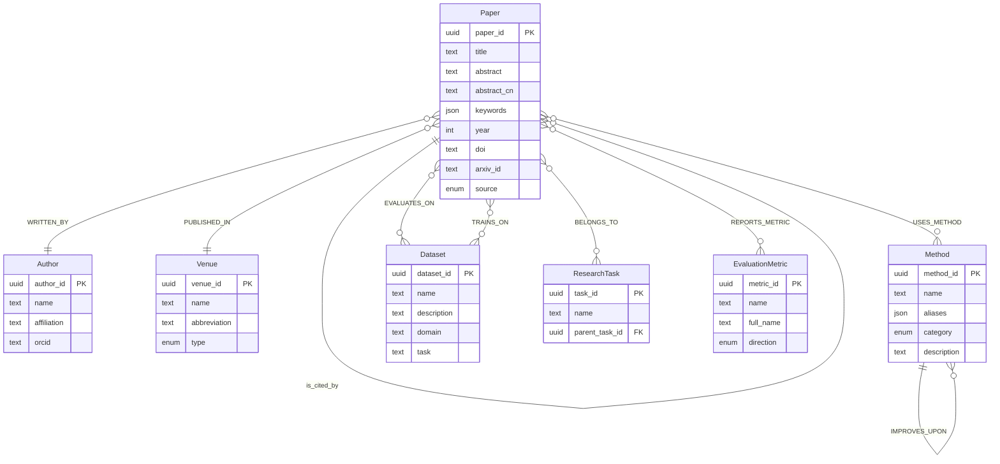

# 🔗 知识图谱设计方案 — 科研灵感助手 v2.0

> 本文档为「科研灵感助手」的知识图谱模块设计方案，涵盖实体建模、关系设计、存储方案、实体提取流程、查询模式，以及与现有 RAG 系统的融合策略。

---

## 目录

- [1. 设计目标](#1-设计目标)
- [2. 实体模型（节点）](#2-实体模型节点)
- [3. 关系模型（边）](#3-关系模型边)
- [4. 图存储方案对比](#4-图存储方案对比)
- [5. 实体提取流程](#5-实体提取流程)
- [6. 图谱查询模式](#6-图谱查询模式)
- [7. 图谱 + RAG 混合检索策略](#7-图谱--rag-混合检索策略)
- [8. 与现有系统的集成点](#8-与现有系统的集成点)
- [9. 分阶段实施路线](#9-分阶段实施路线)

---

## 1. 设计目标

### 核心痛点

当前系统的 RAG 检索依赖**纯文本匹配**（BM25 关键词 + 向量语义相似度），存在以下局限：

| 痛点 | 示例 |
|------|------|
| **术语不统一** | "wav2vec 2.0" vs "self-supervised speech representation" vs "pre-trained acoustic model" 指同一方法，但向量空间距离远 |
| **孤立论文** | 系统不知道 A 论文和 B 论文用了同一个方法 / 同一个数据集，无法通过"方法→论文"反向链接发现关联 |
| **无法回答结构性问题** | "哪些论文用了 ASVspoof 2019 数据集？" "Wav2vec 在音频伪造检测中被用作什么角色？" — 纯文本检索难以精准回答 |
| **缺乏全局视野** | 无法按方法/数据集/任务维度对知识库论文做统计分析 |

### 知识图谱解决什么

```
文本检索（现有）                   图谱检索（新增）
─────────────────────────        ─────────────────────────
"这篇论文章节里有没有提到           "哪些论文用了 wav2vec？
 wav2vec？"                        它们分别怎么用的？
                                  哪些论文的结果更好？"
```

知识图谱把**论文、方法、数据集、作者、指标**从非结构化文本中提取为**结构化实体+关系**，实现：

1. **精准的结构化查询** — "找出所有用 ASVspoof 2019 做评测的论文中，EER 最低的 3 篇"
2. **关系遍历发现** — 从一篇论文出发，沿 `USES_METHOD → USED_BY → EVALUATES_ON` 路径，发现用了相似方法的其他论文
3. **全局统计视图** — 知识库中哪些方法最流行？哪些数据集最常用？哪些指标是领域标准？
4. **图谱增强 RAG** — 在文本检索基础上，注入图谱上下文（如"这篇文章引用了 X，被 Y 引用，用的方法 Z 也在 A/B/C 中出现"）

---

## 2. 实体模型（节点）

### 2.1 Paper（论文实体） ⭐ 核心

知识图谱的核心节点，与现有的 `documents` 表和联网搜索返回的论文统一建模。

```
┌─────────────────────────────────────────┐
│               Paper                      │
├─────────────────────────────────────────┤
│ paper_id        UUID (主键)              │
│ title           TEXT (论文标题)          │
│ abstract        TEXT (英文摘要)          │
│ abstract_cn     TEXT (中文摘要，翻译后)  │
│ keywords        JSON[TEXT] (关键词列表)   │
│ year            INTEGER (发表年份)       │
│ doi             TEXT (DOI，唯一标识)     │
│ arxiv_id        TEXT (arXiv ID)          │
│ url             TEXT (论文 URL)          │
│ pdf_url         TEXT (PDF 下载地址)      │
│ venue_name      TEXT (发表 venue)        │
│ citation_count  INTEGER (引用数)         │
│ language        ENUM(zh/en) (主要语言)   │
│ source          ENUM(upload/search) (来源)│
│ document_id     FK → documents.id (可选) │
│ docling_md      TEXT (Docling 转换的全文)│
│ created_at      DATETIME                 │
│ updated_at      DATETIME                 │
└─────────────────────────────────────────┘
```

**属性设计说明：**

| 属性 | 为什么需要 |
|------|-----------|
| `keywords` | 比全文更精准的论文主题信号，可用于图谱检索的起始点。来源：① 论文自身的 keywords 段 ② LLM 自动提取 |
| `abstract` + `abstract_cn` | 双语摘要支持中英文混合检索和展示 |
| `source` | 区分"用户上传的本地论文" vs "联网搜索到的外部论文"，前者有完整全文，后者只有元数据+摘要 |
| `document_id` | 关联现有的 `documents` 表（已入库的论文），`NULL` 表示仅从联网搜索获取的元数据 |
| `docling_md` | 存储 Docling 转换后的 Markdown 全文。当前存为文件，图谱化后可将全文也纳入实体，用于 LLM 做"实体+全文"联合分析 |

### 2.2 Author（作者实体）

```
┌─────────────────────────────────────────┐
│               Author                     │
├─────────────────────────────────────────┤
│ author_id       UUID (主键)              │
│ name            TEXT (作者姓名)          │
│ affiliation     TEXT (所属机构)          │
│ orcid           TEXT (ORCID，可选)       │
│ paper_count     INTEGER (知识库中论文数) │
│ h_index         INTEGER (可选，联网获取)  │
└─────────────────────────────────────────┘
```

**设计要点：**
- 作者名需要**消歧**（同名不同人），通过 `affiliation` + 合著者网络做初步区分
- `paper_count` 是本地知识库中的计数，非全局

### 2.3 Dataset（数据集实体）

```
┌─────────────────────────────────────────┐
│               Dataset                    │
├─────────────────────────────────────────┤
│ dataset_id      UUID (主键)              │
│ name            TEXT (数据集名称)         │
│ description     TEXT (描述)              │
│ domain          TEXT (领域: speech/NLP/CV)│
│ size            TEXT (规模: "25 hours")  │
│ task            TEXT (关联任务)           │
│ url             TEXT (官方链接)           │
│ year            INTEGER (发布时间)       │
│ license         TEXT (许可证)            │
│ languages       JSON[TEXT] (语言列表)    │
└─────────────────────────────────────────┘
```

**设计要点：**
- 数据集是科研中的重要锚点——"用了同一数据集的论文"是高度相关的
- `task` 字段标注该数据集服务于什么任务（如 ASV="anti-spoofing verification", PFD="partial fake detection"）

### 2.4 Method（方法/模型实体）

```
┌─────────────────────────────────────────┐
│               Method                     │
├─────────────────────────────────────────┤
│ method_id       UUID (主键)              │
│ name            TEXT (方法/模型名称)      │
│ aliases         JSON[TEXT] (别名列表)    │
│ category        ENUM (方法类别)          │
│ description     TEXT (方法描述)          │
│ paper_id        FK → Paper (提出该方法的 │
│                 原始论文，可选)           │
│ year            INTEGER (提出年份)       │
└─────────────────────────────────────────┘
```

**`category` 枚举值：**

| 值 | 含义 | 示例 |
|----|------|------|
| `feature_extractor` | 前端特征提取器 | wav2vec 2.0, HuBERT, WavLM, SincNet |
| `classifier` | 后端分类器 | AASIST, RawNet2, LCNN |
| `loss_function` | 损失函数 | AAM-Softmax, OC-Softmax, BCE |
| `data_augmentation` | 数据增强策略 | RawBoost, SpecAugment, mixup |
| `preprocessing` | 预处理 | VAD, CMVN, FFT |
| `postprocessing` | 后处理 | score calibration, ensembling |
| `framework` | 整体框架/系统 | Rawformer, AudioGPT |
| `evaluation_protocol` | 评测协议 | EER, min t-DCF, LLR |

### 2.5 EvaluationMetric（评价指标实体）

```
┌─────────────────────────────────────────┐
│            EvaluationMetric              │
├─────────────────────────────────────────┤
│ metric_id       UUID (主键)              │
│ name            TEXT (指标名)            │
│ full_name       TEXT (全称)              │
│ description     TEXT (含义解释)          │
│ direction       ENUM(higher_better /     │
│                  lower_better)           │
│ unit            TEXT (单位: %/ms/—)      │
└─────────────────────────────────────────┘
```

**常见指标：** EER, min t-DCF, accuracy, precision, recall, F1, AUC, ROC, MCC

### 2.6 ResearchTask（研究任务实体）

```
┌─────────────────────────────────────────┐
│            ResearchTask                  │
├─────────────────────────────────────────┤
│ task_id         UUID (主键)              │
│ name            TEXT (任务名称)           │
│ description     TEXT (描述)              │
│ parent_task_id  FK → ResearchTask (自引用)│
│ level           INTEGER (层级深度)       │
└─────────────────────────────────────────┘
```

**设计要点：**
- 树形结构，支持任务层级（如 音频安全 → 深度伪造检测 → 部分伪造检测）
- 帮助用户按领域浏览知识库

**任务层级示例：**

```
音频安全 (Audio Security)
├── 音频深度伪造检测 (Audio DeepFake Detection)
│   ├── 全伪造检测 (Full Fake Detection)
│   ├── 部分伪造检测 (Partial Fake Detection)
│   └── 跨数据集泛化 (Cross-Dataset Generalization)
├── 说话人识别 (Speaker Recognition)
│   ├── 近场 (Near-Field)
│   └── 远场 (Far-Field)
└── 音频取证 (Audio Forensics)
    ├── 重压缩检测 (Double Compression Detection)
    └── 来源识别 (Source Identification)
```

### 2.7 Venue（发表 venue）

```
┌─────────────────────────────────────────┐
│               Venue                      │
├─────────────────────────────────────────┤
│ venue_id        UUID (主键)              │
│ name            TEXT (全称)              │
│ abbreviation    TEXT (缩写: ICASSP/CVPR) │
│ type            ENUM(conference/journal/ │
│                  workshop/preprint)      │
│ rank            TEXT (CCF-A/B/C 或       │
│                  SCI Q1/Q2)              │
│ publisher       TEXT (IEEE/ACM/Elsevier) │
└─────────────────────────────────────────┘
```

---

## 3. 关系模型（边）

### 3.1 关系类型总览

```
                    ┌──────────┐
          IMPROVES_UPON      CITES
                    ↓        ↓
 ┌────────┐  WRITTEN_BY   ┌────────┐  PUBLISHED_IN   ┌────────┐
 │ Author │ ←─────────── │ Paper  │ ──────────────→ │ Venue  │
 └────────┘               └────────┘                 └────────┘
                              │  ↑
                USES_METHOD   │  │  USED_BY (逆向)
                              ↓  │
                          ┌────────┐
                          │ Method │  ← 也是 Paper 的子图
                          └────────┘
                              
 ┌────────┐               ┌────────┐                 ┌──────────┐
 │ Dataset│ ← EVALUATES_ON│ Paper  │ ──────────────→ │ Research │
 └────────┘               └────────┘   BELONGS_TO    │  Task    │
      ↑                                               └──────────┘
      │  TRAINS_ON
      │
 ┌────────┐
 │ Paper  │
 └────────┘
```

### 3.2 关系详细定义

#### R1: WRITTEN_BY（论文 ↔ 作者）

```
(Paper)-[:WRITTEN_BY {author_order: 1, is_corresponding: true}]→(Author)
```

| 属性 | 类型 | 说明 |
|------|------|------|
| `author_order` | INTEGER | 作者顺序（1=第一作者） |
| `is_corresponding` | BOOLEAN | 是否为通讯作者 |

**查询价值：** "找出 X 教授作为第一作者的所有论文" / "这些第一作者还有哪些相关论文"

#### R2: CITES（论文 → 论文）

```
(Paper)-[:CITES {context: "...", section: "Introduction"}]→(Paper)
```

| 属性 | 类型 | 说明 |
|------|------|------|
| `context` | TEXT | 引用上下文字段 |
| `section` | TEXT | 引用出现在哪个章节 |
| `citation_type` | ENUM | `background` / `method_comparison` / `baseline` / `uses_dataset` |

**查询价值：** "这篇论文的方法被哪些后续论文改进了？" / "这个领域的基础文献有哪些？"

#### R3: USES_METHOD（论文 → 方法）

```
(Paper)-[:USES_METHOD {
  role: "feature_extractor",
  context: "We use wav2vec 2.0 as the frontend feature extractor...",
  variant: "wav2vec 2.0 Base (fine-tuned)",
  performance_contribution: "positive"
}]→(Method)
```

| 属性 | 类型 | 说明 |
|------|------|------|
| `role` | ENUM | 方法在论文中扮演的角色（见 Method.category） |
| `context` | TEXT | 论文中描述该用法的原文片段 |
| `variant` | TEXT | 使用的是哪个变体（如 wav2vec 2.0 Base vs Large） |
| `performance_contribution` | ENUM | `positive` / `negative` / `neutral` / `ablation_only` |

**这是整个图谱中价值最高的关系**——通过它可以回答：
- "哪些论文用了 wav2vec 做特征提取？"
- "wav2vec 作为 feature_extractor 和作为 classifier 的效果对比"
- "AASIST 方法的各个组件在哪些论文中被改进过？"

#### R4: EVALUATES_ON（论文 → 数据集）

```
(Paper)-[:EVALUATES_ON {
  task: "anti-spoofing",
  split: "eval",
  metrics: {EER: 0.87, "min t-DCF": 0.0258},
  protocol: "standard"
}]→(Dataset)
```

| 属性 | 类型 | 说明 |
|------|------|------|
| `task` | TEXT | 在该数据集上做的任务 |
| `split` | TEXT | train/dev/eval |
| `metrics` | JSON | 在该数据集上的评测指标值 |
| `protocol` | TEXT | 评测协议说明 |

**这是图谱的第二个核心关系**——可以直接进行跨论文性能对比：

> "在 ASVspoof 2019 LA 上，使用 wav2vec 的论文 vs 使用 LFCC 的论文，EER 差距是多少？"

#### R5: TRAINS_ON（论文 → 数据集）

```
(Paper)-[:TRAINS_ON {split: "train+dev"}]→(Dataset)
```

与 EVALUATES_ON 分开，区分训练数据和评测数据。

#### R6: BELONGS_TO（论文 → 研究任务）

```
(Paper)-[:BELONGS_TO {is_primary: true}]→(ResearchTask)
```

一篇论文可以属于多个任务（如既属于"部分伪造检测"也属于"跨数据集泛化"）。

#### R7: IMPROVES_UPON（方法 → 方法）

```
(Method_A)-[:IMPROVES_UPON {
  description: "Replace ECAPA-TDNN with wav2vec 2.0 frontend",
  paper_id: FK → Paper (提出该改进的论文)
}]→(Method_B)
```

**查询价值：** 构建方法演进树——"RawNet2 经历了哪些改进？"

#### R8: PUBLISHED_IN（论文 → Venue）

```
(Paper)-[:PUBLISHED_IN {date: "2024-04"}]→(Venue)
```

#### R9: REPORTS_METRIC（论文 → EvaluationMetric）

```
(Paper)-[:REPORTS_METRIC {
  value: 0.87,
  dataset_id: FK → Dataset,
  condition: "clean",
  notes: "without data augmentation"
}]→(EvaluationMetric)
```

用于横向对比不同论文在同一数据集上的表现。

---

## 4. 图存储方案对比

### 方案 A：MySQL 关系表（推荐 v2.0 首选）

**优势：** 零额外运维，与现有系统共享 MySQL，部署简单

```
现有 6 张表 + 新增 8 张实体表 + 9 张关系表
```

| 实体表 | 关系表 |
|--------|--------|
| `kg_papers` | `kg_paper_author` (WRITTEN_BY) |
| `kg_authors` | `kg_paper_cites_paper` (CITES) |
| `kg_datasets` | `kg_paper_uses_method` (USES_METHOD) |
| `kg_methods` | `kg_paper_evaluates_on` (EVALUATES_ON) |
| `kg_metrics` | `kg_paper_trains_on` (TRAINS_ON) |
| `kg_tasks` | `kg_paper_belongs_to_task` (BELONGS_TO) |
| `kg_venues` | `kg_method_improves_method` (IMPROVES_UPON) |
| (现有 `documents` 不变) | `kg_paper_published_in` (PUBLISHED_IN) |
| | `kg_paper_reports_metric` (REPORTS_METRIC) |

**查询方式：** SQL JOIN + Python 内存图（NetworkX）做路径遍历

### 方案 B：Neo4j / NebulaGraph 专用图数据库

**优势：** 原生图查询（Cypher/nGQL），遍历性能更好，可视化方便

**劣势：** 多一个服务要维护，v2.0 初期可能过重

### 方案 C：NetworkX 内存图（轻量过渡）

**优势：** 零部署，Python native，适合 < 1000 篇论文的场景

**劣势：** 内存占用，重启丢失（需持久化到 JSON/SQLite）

### 推荐策略

```
v2.0 → 方案 A（MySQL 关系表 + NetworkX 查询缓存）
v3.0 → 方案 B（当论文量 > 1000 时考虑迁移到 Neo4j）
```

---

## 5. 实体提取流程

### 5.1 提取时机

```
用户上传 PDF
    │
    ▼
Docling PDF → MD (现有流程)
    │
    ├──→ 现有流程: 分块 → Embedding → Chroma + BM25
    │
    └──→ 新增: 图谱实体提取
              │
              ├── 5a. 标题页元数据提取 (正则)
              ├── 5b. LLM 结构化信息提取
              ├── 5c. 引用关系解析
              └── 5d. 实体消歧 + 入库
```

### 5a. 标题页元数据提取（正则，离线快速）

从 Docling 转换的 Markdown 中，用正则提取：

```
标题页 → title, authors, affiliations, abstract, keywords, venue, year
```

- `title`: MD 第一个 `#` 标题
- `authors`: `^[A-Z][a-z]+ [A-Z][a-z]+.*` 模式匹配
- `keywords`: `**Keywords**:` 或 `Keywords—` 后面的内容
- `abstract`: "Abstract" 章节的内容
- `venue`: 页脚版权信息（如 "© 2024 IEEE"）

### 5b. LLM 结构化信息提取（核心）

对每篇新入库的论文，调用一次 LLM 提取结构化实体。

**Prompt 设计：**

```
你是一个学术论文信息提取专家。请从以下论文中提取结构化信息。

【论文全文 Markdown】
{paper_markdown}

请提取以下信息，以 JSON 格式返回：

1. **数据集** — 论文中使用的所有数据集（训练/评测），包括名称和用途
2. **方法/模型** — 论文提出或使用的所有方法，包括：
   - 方法名称
   - 类别（feature_extractor / classifier / loss_function / data_augmentation / framework）
   - 在论文中的角色
   - 如果使用了已有方法，标注原始论文的标题/作者
3. **评价指标** — 论文报告的主要指标及在哪些数据集上的数值
4. **研究任务** — 该论文属于哪个/哪些研究任务
5. **引用关系** — 论文中引用了哪些关键的前置工作（只列论文标题中有明确方法贡献的）

输出格式：
{
  "datasets": [{"name": "ASVspoof 2019", "role": "eval", "task": "anti-spoofing"}],
  "methods": [{"name": "wav2vec 2.0", "category": "feature_extractor", "role": "frontend feature extractor", "variant": "Base"}],
  "metrics": [{"name": "EER", "value": 0.87, "dataset": "ASVspoof 2019"}],
  "tasks": ["部分伪造音频检测"],
  "key_references": [{"title": "wav2vec 2.0: A Framework for...", "authors": ["Baevski A"], "year": 2020, "citation_context": "frontend feature extractor"}]
}
```

**LLM 选择：** 使用现有的 Qwen3-max（DashScope），提取一篇论文约消耗 2K~4K token。

**优化策略：**
- 仅对**新入库论文**执行提取（一次性的）
- 对 10K token 以上的长论文，先按章节做摘要压缩，再提取
- 提取结果缓存到 `kg_*` 表中，重复入库的论文（MD5 去重）不重复提取

### 5c. 引用关系解析

论文的 References 部分通常在 Docling 转换后保留较好，可以：

1. **正则匹配** References 章节中的 `[N] Title. Authors. Venue, Year.` 格式
2. **联网补全** 对匹配到的引用，通过 Semantic Scholar / OpenAlex API 获取标准化的论文元数据
3. **内部链接** 如果被引用的论文也在知识库中，建立直接的 CITES 边

### 5d. 实体消歧与合并

| 场景 | 策略 |
|------|------|
| 同一方法不同写法 | 通过 `aliases` 字段存储变体名（如 "wav2vec 2.0" / "wav2vec2" / "wav2vec 2.0 Base"），LLM 提取时归一化到 canonical name |
| 同一数据集不同变体 | 如 "ASVspoof 2019 LA" / "ASVspoof2019" / "ASVspoof 2019 Logical Access"，提取 `canonical_name` + `variant` 双字段 |
| 同一作者不同写法 | "A. Baevski" / "Alexei Baevski"，用 affiliation + 合著者网络做匹配 |
| 同名作者不同人 | 用 `affiliation` + 所在论文的研究领域区分，标记 `disambiguation_status: tentative/confirmed` |

---

## 6. 图谱查询模式

### 6.1 基础查询（Cypher / SQL 等价）

**Q1: 找出使用了指定方法的所有论文**

```cypher
MATCH (p:Paper)-[r:USES_METHOD]->(m:Method {name: "wav2vec 2.0"})
WHERE r.role = "feature_extractor"
RETURN p.title, p.year, r.variant, r.performance_contribution
ORDER BY p.year DESC
```

→ 回答："知识库中有哪些论文用 wav2vec 做特征提取？效果如何？"

**Q2: 找出在同一数据集上评测的论文及性能排名**

```cypher
MATCH (p:Paper)-[r:EVALUATES_ON]->(d:Dataset {name: "ASVspoof 2019 LA"})
RETURN p.title, r.metrics.EER AS eer
ORDER BY eer ASC
LIMIT 10
```

→ 回答："ASVspoof 2019 LA 上 EER 最低的论文是哪些？"

**Q3: 论文的共同作者网络**

```cypher
MATCH (p1:Paper {paper_id: $paper_id})-[:WRITTEN_BY]->(a:Author)<-[:WRITTEN_BY]-(p2:Paper)
WHERE p1 <> p2
RETURN a.name, collect(DISTINCT p2.title) AS co_papers
```

→ 回答："这篇论文的作者还发表了哪些相关论文？"

### 6.2 高级查询

**Q4: 方法演进链**

```cypher
MATCH path = (m_end:Method)-[:IMPROVES_UPON*1..4]->(m_start:Method {name: "RawNet2"})
RETURN path
```

→ 回答："从 RawNet2 出发，经历了哪些改进路线？"

**Q5: 两篇论文的关联路径**

```cypher
MATCH path = shortestPath((p1:Paper)-[*..4]-(p2:Paper))
WHERE p1.paper_id = $id1 AND p2.paper_id = $id2
RETURN path
```

→ 回答："论文 A 和论文 B 的关联是什么？（共用方法？同一作者？同一数据集？互相引用？）"

**Q6: 研究空白发现**

```cypher
// 找出某个方法被广泛用于分类器、但从未被用作特征提取器的论文
MATCH (m:Method {name: "AASIST"})<-[:USES_METHOD {role: "classifier"}]-(p:Paper)
WHERE NOT exists((:Paper)-[:USES_METHOD {role: "feature_extractor"}]->(m))
RETURN DISTINCT m.name
```

→ 回答："AASIST 在知识库中被广泛用作分类器，但没有论文探索它作为特征提取器的效果——这可能是一个研究空白。"

### 6.3 Agent 工具定义

图谱查询封装为新的 Agent Tool：

```json
{
  "name": "query_paper_graph",
  "description": "从知识图谱中结构化查询论文、方法、数据集、作者及其关系。用于回答涉及跨论文比较、方法关联、性能对比的结构化问题。",
  "parameters": {
    "query_type": {
      "enum": [
        "papers_by_method",       // 哪些论文用了某方法
        "papers_by_dataset",      // 哪些论文在某数据集上评测
        "papers_by_author",       // 某作者的论文
        "papers_by_task",         // 某研究任务的论文
        "method_evolution",       // 方法演进链
        "performance_ranking",    // 某数据集上的性能排名
        "related_papers",         // 找与某论文最相关的其他论文（图谱路径）
        "method_co_occurrence",   // 哪些方法经常一起使用
        "dataset_co_occurrence",  // 哪些数据集经常一起出现
        "research_gap"            // 发现可能的研究空白
      ]
    },
    "entity_name": {"type": "string"},
    "entity_type": {"type": "string", "enum": ["method", "dataset", "author", "task", "paper"]},
    "limit": {"type": "integer", "default": 5}
  }
}
```

---

## 7. 图谱 + RAG 混合检索策略

### 7.1 融合架构

```
用户查询
    │
    ├──→ 现有 RAG 管道 (保持不变)
    │     查询改写 → BM25+语义 → RRF 融合 → Cross-Encoder 精排
    │     → 返回 top-k 文本 chunks
    │
    ├──→ 新增: 图谱查询管道
    │     LLM 解析查询意图 → 选择 query_type → 图遍历
    │     → 返回结构化实体 + 关系路径
    │
    ▼
 混合上下文组装
    │
    ├── 文本 chunks（RAG 结果）
    ├── 图谱实体（结构化回答的数据支撑）
    ├── 跨论文关系路径（图谱遍历发现的关联）
    └── 性能对比表格（自动聚合的指标）
    │
    ▼
 LLM 综合生成回复
```

### 7.2 查询路由

LLM 根据用户问题的类型决定走哪条管道：

| 问题类型 | 路由策略 |
|----------|---------|
| "这篇论文讲了什么？" | RAG (文本检索) |
| "有哪些论文用了 wav2vec？" | 图谱查询 (USES_METHOD) |
| "wav2vec 在伪造检测中效果如何？" | 图谱 (USES_METHOD + EVALUATES_ON 拿指标) + RAG (拿具体分析) |
| "这个领域还有什么没做好的方向？" | 图谱 (研究空白查询) + RAG (limitations 文本) |

### 7.3 混合上下文示例

用户问："**帮我分析一下 wav2vec 在部分伪造音频检测中的应用现状**"

Agent 组装上下文：

```
【图谱结构化信息】
1. 知识库中有 8 篇论文使用 wav2vec 2.0 做部分伪造检测
   - 作为 feature_extractor: 7 篇
   - 作为 classifier backbone: 1 篇
2. 最常见的前端组合: wav2vec 2.0 + AASIST (3 篇)
3. ASVspoof 2019 LA 上性能排名:
   | 论文 | wav2vec 变体 | EER |
   | ...  | ...        | ... |
4. 方法演进: wav2vec 2.0 → WavLM → ...?
5. 研究空白: LCNN + wav2vec 的组合未被探索

【文本检索内容】（RAG 返回的相关 chunks）
- [论文 A, Introduction] "wav2vec 2.0 has shown superior..."
- [论文 B, Method] "We fine-tune wav2vec 2.0 on..."
...
```

这样的话，LLM 既能看到**结构化的全局视角**（图谱），也能看到**具体的文本细节**（RAG），生成的回复会比纯 RAG 更全面、更有洞察。

---

## 8. 与现有系统的集成点

### 8.1 现有数据如何迁移

| 现有数据 | 迁移到图谱 | 方式 |
|---------|-----------|------|
| `documents` 表 (filename, md5_hash, file_path) | `kg_papers` 表 | 批量回溯处理：对每篇已入库论文运行 LLM 实体提取 |
| `chunks` 表 (section_name, content) | 不直接迁移 | 作为 LLM 提取的输入原文 |
| 消息中嵌入的论文 JSON (联网搜索的结果) | `kg_papers` 表 | 新论文自动入图 |
| BM25 索引中的 chunk 文本 | 不直接迁移 | — |

### 8.2 新增文件结构

```
knowledge_graph/
├── __init__.py
├── models.py              # 图谱 ORM 模型 (kg_papers, kg_authors, ...)
├── entity_extractor.py    # 实体提取 (正则 + LLM)
├── entity_linker.py       # 实体消歧与合并
├── graph_store.py         # 图操作 (MySQL + NetworkX)
├── graph_query.py         # 图谱查询执行 (cypher → SQL)
├── graph_tool.py          # Agent Tool: query_paper_graph
├── citation_parser.py     # References 引用解析
└── graph_rag_fusion.py    # 图谱 + RAG 混合策略
```

### 8.3 对现有模块的改动

| 模块 | 改动 | 程度 |
|------|------|------|
| `config.py` | 新增图谱相关配置常量 | 极小 |
| `database/models.py` | 新增 8 张实体表 + 9 张关系表 | 新增（不改现有） |
| `knowledge_base/document_processor.py` | 处理完成后触发 `extract_entities()` | 加一行调用 |
| `agent/agent_core.py` | SYSTEM_PROMPT 中加入 `query_paper_graph` 工具描述 | 极小 |
| `agent/tools.py` | 新增 `query_paper_graph` 工具定义 + 执行 | 新增函数 |
| `app.py` | 前端展示图谱节点/关系信息 | 新增 UI 组件 |

**所有现有功能不受影响**——图谱是增强层，不是替代层。

---

## 9. 分阶段实施路线

### Phase 1: 基础图存储（2-3 天）

```
目标: 论文入图，能用 SQL 做基本查询

□ 新增 kg_* 表的 ORM 模型
□ 上传论文时自动创建 Paper 节点
□ 标题页元数据提取 (正则: title, authors, year, keywords, abstract)
□ Author 实体创建与简单消歧
□ Paper-WRITTEN_BY-Author 关系建立
```

### Phase 2: LLM 实体提取（2-3 天）

```
目标: 方法、数据集、指标自动入图

□ LLM 结构化信息提取 Pipeline
□ Method 实体创建与别名管理
□ Dataset 实体创建
□ Paper-USES_METHOD, Paper-EVALUATES_ON 关系建立
□ 提取结果人工抽检 + 纠错机制
```

### Phase 3: 图谱查询工具（2 天）

```
目标: Agent 能调用图谱回答结构化问题

□ graph_query.py — 6 大查询类型实现
□ query_paper_graph Tool 集成到 Agent
□ SYSTEM_PROMPT 更新（何时用图谱 vs 何时用 RAG）
□ 图谱查询结果格式化（给 LLM 看的文本 + 给前端看的结构化数据）
```

### Phase 4: 混合检索 + 高级功能（3-4 天）

```
目标: 图谱 + RAG 融合，回答质量显著提升

□ 查询路由器 (LLM 判断走 RAG / 图谱 / 混合)
□ 混合上下文组装（图谱结构化 + RAG 文本 → LLM）
□ 引用关系解析 (References → CITES 边)
□ 研究空白自动发现
□ 前端图谱可视化 (可选的网络图/力导向图)
```

---

## 附录 A：实体关系 ER 图（Mermaid）



## 附录 B：与 README.md v2.0 规划对应

| README v2.0 规划项 | 本设计文档对应章节 |
|-------------------|-------------------|
| 论文实体自动提取 | §5 实体提取流程 |
| 图谱存储 | §4 图存储方案对比 |
| `query_paper_graph` Tool | §6.3 Agent 工具定义 |
| 图谱辅助 RAG | §7 图谱 + RAG 混合检索策略 |
| 跨论文对比 + 性能汇总 | §7.3 混合上下文示例 |
| 研究空白发现 | §6.2 Q6 研究空白发现 |

---

> **文档状态：** v1.0 设计稿  
> **适用范围：** 科研灵感助手 v2.0 知识图谱模块  
> **不涉及代码变更** — 本方案为架构设计，实施前需评审确认技术选型（MySQL 图 vs Neo4j）
